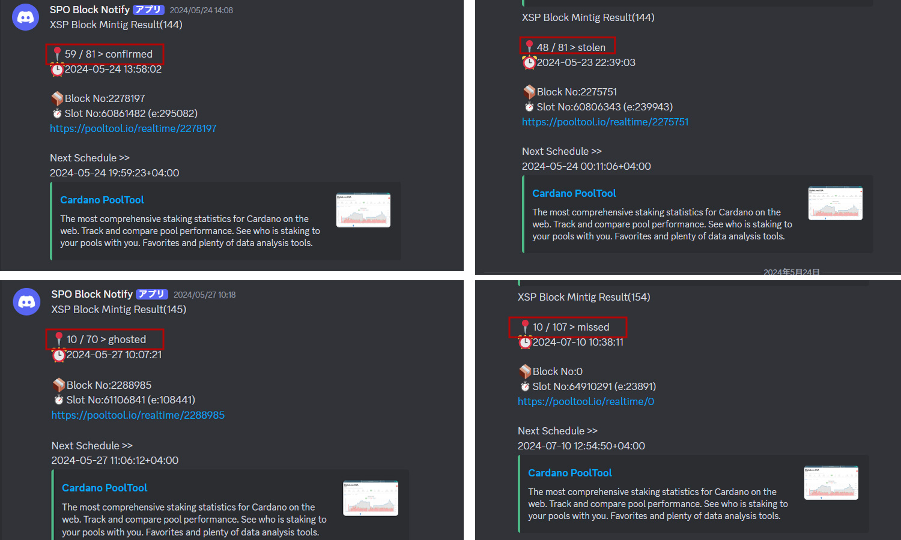

# SPO Block Notify

Notify block mint results and Next Block Schedule to any message platform.

Block status Notify


Next schedule Notify


## Supported languages
Japanese, English, Portuguese, Spanish, French, Korean, Thai, and Vietnamese

## Supported platforms
[LINE](https://notify-bot.line.me/ja/) / [Discord](https://support.discord.com/hc/en-us/articles/228383668-Intro-to-Webhooks) / [Slack](https://api.slack.com/messaging/webhooks) / [Telegram](https://core.telegram.org/bots/api)

## Setup

<details>

<summary>English Ver.</summary>

### 0.Prerequisites
- It is necessary to set up cncli.sh developed by the guild operator in advance.
[https://cardano-community.github.io/guild-operators/Scripts/cncli/](https://cardano-community.github.io/guild-operators/Scripts/cncli/)

- This program must be installed on the server where cncli.sh and the accompanying CNCLI blocklog are set up.

### 1.Install Dependent Programs

Update OS Packages
```bash
sudo apt update && sudo apt upgrade -y
```

Check python version
```bash
python3 -V
```
> Python 3.10 over

If you have Python 3.9 or lower, please use this tool to update.
```
cd
wget https://raw.githubusercontent.com/btbf/spojapanguild/master/scripts/pythonUpdate.sh
chmod +x pythonUpdate.sh
./pythonUpdate.sh
```

Install dependencies
```bash
sudo apt install -y build-essential libssl-dev libffi-dev python3-dev python3-pip python3-testresources
```
```bash
pip3 install watchdog pytz python-dateutil requests discordwebhook slackweb i18nice
```

**Download the executable script and configuration file**

```bash
bn_release="$(curl -s https://api.github.com/repos/btbf/block-notify/releases/latest | jq -r '.tag_name')"
wget https://github.com/btbf/block-notify/archive/refs/tags/${bn_release}.tar.gz -P $NODE_HOME/scripts
cd $NODE_HOME/scripts
tar zxvf ${bn_release}.tar.gz block-notify-${bn_release}/block_notify.py block-notify-${bn_release}/config.ini block-notify-${bn_release}/i18n/ 
mv block-notify-${bn_release} block-notify
rm ${bn_release}.tar.gz
```

### How to use

Editing Configuration Files

```
cd block-notify
nano config.ini
```

| item      | Valus      | usage                          |
| ----------- |---------| ------------------------------------ |
| `pool_ticker`      | ex.) SJG | pool ticker name  |
| `notify_language` | english:`en`<br>japanese:`ja`<br>Portuguese:`pt`<br>French:`fr`<br>Spanish:`es` | notification language |
| `notify_timezone`   | Asia/Tokyo<br>[Timezone List](https://gist.github.com/heyalexej/8bf688fd67d7199be4a1682b3eec7568) | Specify your[Timezone](https://gist.github.com/heyalexej/8bf688fd67d7199be4a1682b3eec7568) |
| `notify_platform`   | `Line`<br>`Discord`<br>`Slack`<br>`Telegram` | Specify the platform to be notified<br> (Multiple designations are invalid.) |
| `notify_level`   |All:`All`<br>Other Confirm:`ExceptCofirm`<br>Only Miss:`OnlyMissed`  | Set notification level |
| `nextepoch_leader_date`   |Only Summary:`SummaryOnly`<br>Summary and date:`SummaryDate` | Notification of next epoch schedule date/time<br>If you do not want the list of next epoch schedule dates to flow to notifications, please include `SummaryOnly`. |
| `line_notify_token`     |Line notify token id | Enter Line Notify token |
| `discord_webhook_url`   |discord_webhook_url | Enter discord_webhook_url |
| `slack_webhook_url`   |slack web hookurl| Enter slack web hookurl |
| `telegram_token`   |Telegram API Token | Enter Telegram API Token |
| `telegram_id`   |Telegram Chat id| Enter Telegram Chat id |
| `node_home` |ex.)`/home/usr/cnode`| Enter 'node_home' Directory Path |
| `guild_db_dir` |ex.)`%(node_home)s/guild-db/blocklog/`| Enter the path to guild-db<br>Do not change `%(node_home)s` as it is a variable |
| `shelley_genesis` |ex.)`%(node_home)s/files/shelley-genesis.json`| Enter the file path for shelley_genesis<br>Do not change `%(node_home)s` as it is a variable |
| `byron_genesis` |ex.)`%(node_home)s/files/byron-genesis.json`| Enter the file path for byron_genesis<br>Do not change `%(node_home)s` as it is a variable |


### **Configure the service file**

```bash
cat > $NODE_HOME/service/cnode-blocknotify.service << EOF 
# file: /etc/systemd/system/cnode-blocknotify.service

[Unit]
Description=Cardano Node - SPO Blocknotify
BindsTo=cnode-cncli-sync.service
After=cnode-cncli-sync.service

[Service]
Type=simple
User=$(whoami)
WorkingDirectory=${NODE_HOME}/scripts/block-notify
ExecStart=/bin/bash -c 'cd ${NODE_HOME}/scripts/block-notify/ && python3 -u block_notify.py'
Restart=on-failure
StandardOutput=syslog
StandardError=syslog
SyslogIdentifier=cnode-blocknotify

[Install]
WantedBy=cnode-cncli-sync.service
EOF
```

```
sudo cp $NODE_HOME/service/cnode-blocknotify.service /etc/systemd/system/cnode-blocknotify.service
```

```
sudo chmod 644 /etc/systemd/system/cnode-blocknotify.service
sudo systemctl daemon-reload
sudo systemctl enable cnode-blocknotify.service
```

Activate SPO BlockNotify
```
sudo systemctl start cnode-blocknotify.service
```

Add an alias for checking logs to the environment variable
```
echo alias blocknotify='"journalctl --no-hostname -u cnode-blocknotify -f"' >> $HOME/.bashrc
```

Environment variable reloading
```
source $HOME/.bashrc
```

Startup Confirmation
```
blocknotify
```

The following indications are fine.
> [xxx] SPO Block Notify has been started.

</details>

<details>

<summary>日本語 Ver.</summary>

### 0.前提条件

- 事前にギルドオペレータが開発したcncli.shのセットアップが必要です。
[https://cardano-community.github.io/guild-operators/Scripts/cncli/](https://cardano-community.github.io/guild-operators/Scripts/cncli/)

- このプログラムはcncli.shと付随するCNCLI blocklogがセットアップされたサーバーへインストールする必要があります。

- SPO JAPAN GUILDマニュアルを使用している場合は、こちらの[セットアップガイド](https://docs.spojapanguild.net/setup/11-blocknotify-setup/)をご参照ください。

### 1.依存プログラムをインストールする**

**Python環境をセットアップする**

パッケージを更新する
```bash
sudo apt update && sudo apt upgrade -y
```

pythonバージョンを確認する
```bash
python3 -V
```
> Python 3.10以上

Python 3.9以下の場合こちらのツールでアップデートしてください
```
cd
wget https://raw.githubusercontent.com/btbf/spojapanguild/master/scripts/pythonUpdate.sh
chmod +x pythonUpdate.sh
./pythonUpdate.sh
```

依存関係をインストールする
```bash
sudo apt install -y build-essential libssl-dev libffi-dev python3-dev python3-pip python3-testresources
```
```bash
pip3 install watchdog pytz python-dateutil requests discordwebhook slackweb i18nice
```

**実行スクリプトと設定ファイルをダウンロードする**

```bash
bn_release="$(curl -s https://api.github.com/repos/btbf/block-notify/releases/latest | jq -r '.tag_name')"
wget https://github.com/btbf/block-notify/archive/refs/tags/${bn_release}.tar.gz -P $NODE_HOME/scripts
cd $NODE_HOME/scripts
tar zxvf ${bn_release}.tar.gz block-notify-${bn_release}/block_notify.py block-notify-${bn_release}/config.ini block-notify-${bn_release}/i18n/ 
mv block-notify-${bn_release} block-notify
rm ${bn_release}.tar.gz
```

### 使い方

設定ファイルの編集

```
cd block-notify
nano config.ini
```

| 項目      | 値      | 使用用途                          |
| ----------- |---------| ------------------------------------ |
| `pool_ticker`      | ex.) SJG | プールティッカー名を入力する  |
| `notify_language` | 英語:`en`<br>日本語:`ja`<br>ポルトガル語:`pt`<br>フランス語:`fr`<br>スペイン語:`es`| 通知言語を入力する |
| `notify_timezone`   | Asia/Tokyo<br>[タイムゾーン一覧](https://gist.github.com/heyalexej/8bf688fd67d7199be4a1682b3eec7568) | お住いの[タイムゾーン](https://gist.github.com/heyalexej/8bf688fd67d7199be4a1682b3eec7568)を指定する |
| `notify_platform`   | `Line`<br>`Discord`<br>`Slack`<br>`Telegram` | 通知先プラットフォームを指定する<br> (複数指定は無効) |
| `notify_level`   |全て:`All`<br>Confirm以外:`ExceptCofirm`<br>Missのみ:`OnlyMissed`  | 通知基準を設定する |
| `nextepoch_leader_date`   |概要のみ:`SummaryOnly`<br>概要と日付:`SummaryDate` | 次エポックスケジュール日時の通知有無<br>次エポックスケジュール日付一覧を通知に流したくない場合は`SummaryOnly`を記載してください |
| `line_notify_token`     |[LINE設定の(8)](#__tabbed_1_1)で発行したトークンID | Line Notifyトークンを入力する |
| `discord_webhook_url`   |[Discord設定の(7)](#__tabbed_1_2)で発行したウェブフックURL| DiscordウェブフックURLを入力する |
| `slack_webhook_url`   |[Slack設定の(4)](#__tabbed_1_4)で発行したWebhook URL| SlackウェブフックURLを入力する |
| `telegram_token`   |[Telegram設定の(5)](#__tabbed_1_3)で発行したAPIトークン | Telegram APIトークンを入力する |
| `telegram_id`   |[Telegram設定の(9)](#__tabbed_1_3)で表示されたChat id| Telegram ChatIDを入力する |
| `node_home` |ex.)`/home/usr/cnode`| node_homeディレクトリパスを入力する |
| `guild_db_dir` |ex.)`%(node_home)s/guild-db/blocklog/`| guild-dbのパスを入力する<br>`%(node_home)s`は変数のため変更しないでください |
| `shelley_genesis` |ex.)`%(node_home)s/files/shelley-genesis.json`| shelley_genesisのファイルパスを入力する<br>`%(node_home)s`は変数のため変更しないでください |
| `byron_genesis` |ex.)`%(node_home)s/files/byron-genesis.json`| byron_genesisのファイルパスを入力する<br>`%(node_home)s`は変数のため変更しないでください |


### **サービスファイルを設定する**

```bash
cat > $NODE_HOME/service/cnode-blocknotify.service << EOF 
# file: /etc/systemd/system/cnode-blocknotify.service

[Unit]
Description=Cardano Node - SPO Blocknotify
BindsTo=cnode-cncli-sync.service
After=cnode-cncli-sync.service

[Service]
Type=simple
User=$(whoami)
WorkingDirectory=${NODE_HOME}/scripts/block-notify
ExecStart=/bin/bash -c 'cd ${NODE_HOME}/scripts/block-notify/ && python3 -u block_notify.py'
Restart=on-failure
StandardOutput=syslog
StandardError=syslog
SyslogIdentifier=cnode-blocknotify

[Install]
WantedBy=cnode-cncli-sync.service
EOF
```

```
sudo cp $NODE_HOME/service/cnode-blocknotify.service /etc/systemd/system/cnode-blocknotify.service
```

```
sudo chmod 644 /etc/systemd/system/cnode-blocknotify.service
sudo systemctl daemon-reload
sudo systemctl enable cnode-blocknotify.service
```
SPO BlockNotifyを起動する
```
sudo systemctl start cnode-blocknotify.service
```

環境変数にログ確認用エイリアスを追加する
```
echo alias blocknotify='"journalctl --no-hostname -u cnode-blocknotify -f"' >> $HOME/.bashrc
```
環境変数再読み込み
```
source $HOME/.bashrc
```

起動確認
```
blocknotify
```
以下の表示なら正常です。
> [xxx] ブロック生成ステータス通知を起動しました  

</details>